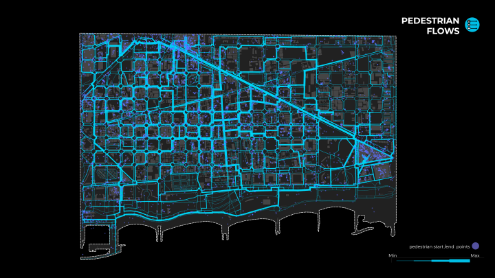
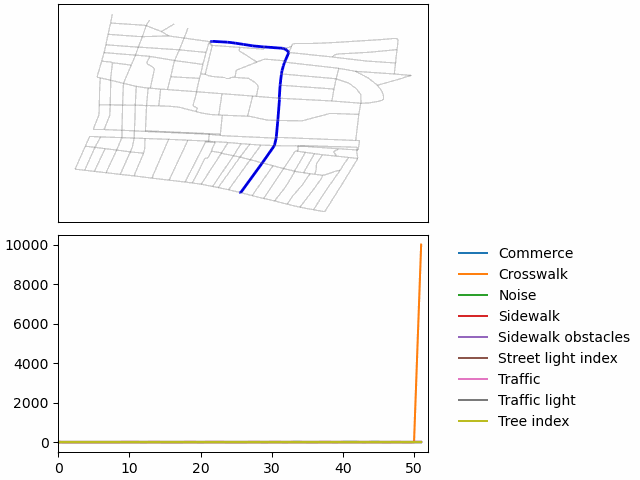

# CityGraph

City Graph is a tool to analyze the road network of a cities through the point of view of a simulated city users.
It was developed as part of the [Master in City and Technology - IAAC](https://iaac.net/educational-programmes/masters-programmes/master-in-city-technology/)
by:
- Adriana Aguirre Such
- Alvaro Cerezo
- Dongxuan Zhu
- Diana Roussi
- Hebah Qatanany
- Leyla Saadi
- Mario Gonzalez
- Inigo Esteban Marina
- Tugdual Sarazin

## Concepts

### Graph
To simulate a road network City Graph use a graph to represents the road network of a city.
So each road, sidewalk, bike lane,  are represented as edges of the graph.
Each edges have attributes to represent it.

### Agents
City users are simulated by agents who choose the best path to go from one node to another of the graph.
Attributes of edges have positive or negative impacts on the agent.
Each type of agents will not be affected in the same way by attributes.
For example the noise from the street could have a very negative impacts on a pedestrian but a limited impacts on a car driver.  
So the best path is the path who minimize the sum of negative impacts.
The [NetworkX weighted Dijkstra](https://networkx.org/documentation/stable/reference/algorithms/generated/networkx.algorithms.shortest_paths.weighted.dijkstra_path.html) algorithm computes. 

## Tool parameters
The parameters of City Graph are:
- Type of attributes
- Type of agents
- Effects of each attribute on each type of agents
- The source shapefile to define the graph

